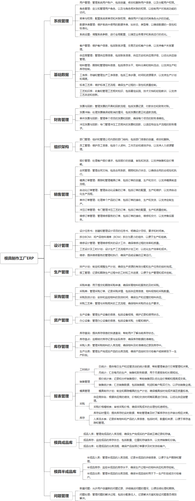

 

    
 

公司拥有上百套具有自主知识产权的软件系统，详情请查看码云首页或公司官网

 
<h1>模具制作工厂ERP</h1>

<a href="https://www.haishi.net.cn/">公司官网</a> ｜ <a href="https://www.haishi.net.cn/">在线体验</a>

 

## 系统介绍

看板项目未部署，主要为业务数据看板。
管理系统是一个综合性的企业管理平台，涵盖了项目里程碑、系统监控、财务管理、生产报表、基本档案、样本及耗材管理、工艺流程、首页、车间派工单、近六个月的月度合格率、项目管理、效率报表、人员档案、扫码记录、仓库报表和质量管理等多个功能模块。
看板项目未部署，主要为业务数据看板。
管理系统是一个综合性的企业管理平台，涵盖了项目里程碑、系统监控、财务管理、生产报表、基本档案、样本及耗材管理、工艺流程、首页、车间派工单、近六个月的月度合格率、项目管理、效率报表、人员档案、扫码记录、仓库报表和质量管理等多个功能模块。
本项目名称为模具制作工厂ERP系统，是针对模具制作工厂的企业资源计划管理系统。该系统涵盖了从客户管理、供应商管理、物料管理到销售管理、生产管理、采购管理、库存管理、财务管理、资产管理以及组织架构管理等各个方面，旨在帮助模具制作工厂实现全流程的信息化管理，提高生产效率，降低运营成本，增强企业竞争力。
本项目主要面向管理端用户，提供一个统一的平台进行企业资源的管理和调配。
- 管理端系统：工厂内部管理人员使用，可以进行系统管理、基础数据管理、财务管理、组织架构管理、销售管理、生产管理、采购管理、资产管理、库存管理以及模具成品库管理等。
                

## 系统功能介绍

### 系统包含终端说明

管理端（WEB）

| 序号 | 模块 | 模块说明 |
| --- | --- | --- |
| 1 | GC-ERP-MJZZHY-APP-MP | 小程序 |
| 2 | GC-ERP-MJZZHY-MANAGE-MANAGE | 管理端 |
| 3 | GC-ERP-MJZZHY-SERVER | 服务端 |

### 系统功能结构

### 系统功能说明

主要功能：
* **销售管理：**  包含从报价到合同签订，以及各种类型订单（模具、自动化、单件、冲压、维修）的管理，贯穿整个销售流程。
* **生产管理：**  支持排产计划功能，可以有效安排生产任务，优化生产资源。
* **库存管理：** 提供库存查询、采购入库、生产出库等功能，实现对库存的实时监控和高效管理，特别是针对模具成品库的出入库和库存管理。
* **财务管理：**  涵盖发票与回款管理，细分到单件和冲压业务，方便财务人员进行精确的财务核算。
* **基础数据管理：**  包含客户、供应商、物料、工序、标准工艺、工艺知识库等基础数据的管理，为其他模块提供数据支撑。

## 系统主要界面

## 系统技术说明

### 代码模块说明

| 序号 | 目录 | 目录说明 |
| --- | --- | --- |
| 1 | GC-ERP-MJZZHY-SERVER/.idea | -- |
| 2 | GC-ERP-MJZZHY-SERVER/src | -- |

### 系统技术选型

#### 开发语言/框架

JAVA（JDK1.8）
前端框架：VUE2

#### 服务中间件

Nginx
Tomcat

#### 数据库

MySQL（5.7+）
Redis

#### 其他说明

无

## 系统演示/商用

请扫码添加客服微信获取演示地址和系统详细资料。

如果您想基于模具制作工厂ERP进行商业化交付或定制开发服务，我们提供有偿的技术服务支持，合作模式不限，欢迎沟通！

公司官网地址： <a href="https://www.haishi.net.cn/">https://www.haishi.net.cn</a>

联系客服获取专业回答。

## 使用须知

1、 本项目商用必须获得版权所有者的授权。

2、 未经允许本项目代码不允许二次出售。

